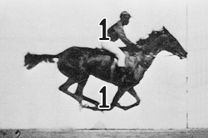
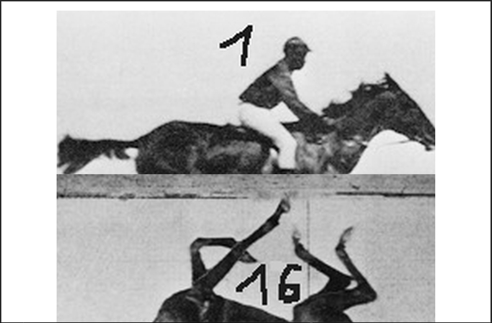

# Make a PDF for a Flipbook

If you're making a hand-cranked flipbook like [this](https://www.youtube.com/watch?v=UInHQr0IQEg) or [that](https://www.youtube.com/watch?v=F7gc3fA-CG0) or [this](https://www.youtube.com/watch?v=oVCod62KKcc) - creating the printable PDF from the animation by yourself is a pain. Fear not, this script is here.

It takes a folder full of images in folder `/animation` and crops them, stitches the current and the next frame together. On the last frame, the first one is used again for conatnous rotation. Check the [test result](output/flipbook-325.0x281.3mm.pdf) out:


[(source)](https://en.wikipedia.org/wiki/File:Muybridge_race_horse_animated.gif)

*Result of 7th page*: Current upper half and the lower half of the next frame, cropped/fitted to one A3 page:


The images are stored in the `/processed` folder: Firstly scaled and then after the re-composition.

### Tips
>Change the desired output width/height for each frame at the beginning of the script.
>
>Make sure to name the files with leading zeros `01.jpg` and `02.jpg` not `1.jpg` as the files are not rearranged naturally.
>
>Use [ezgif](https://ezgif.com/gif-to-jpg/) for GIF animation to single jpegs.
>
>Or use ffmpeg `ffmpeg -i "input.mp4" -vsync 0 frames/frame_%05d.png` for video files.

### Notes
Landscape and A3 is hardcoded.

## Installation
```
pip install pillow reportlab
```

---

*Shamefully Vibe "coded".*